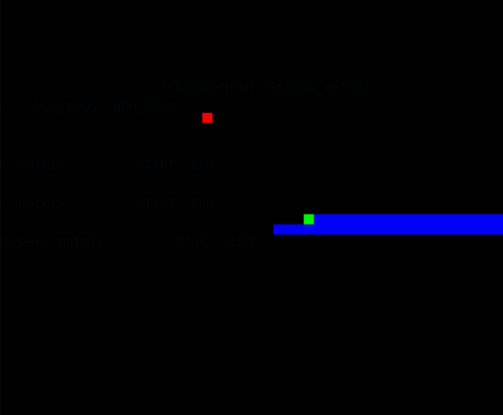

# AlgoVisualizer

<!-- PROJECT LOGO -->
<p align="center">
  <h3 align="center"><b>AlgoVisualizer</b></h3>

  <p align="center">
    Built to help visualize common computer science algorithms.
    <!-- <br /> -->
    <!-- <a href="https://github.com/dgobalak/AlgoVisualizer"><strong>Explore the docs »</strong></a> -->
    <br>
    <!-- <a href="https://github.com/github_username/repo_name">View Demo</a>
    · -->
    <a href="https://github.com/dgobalak/AlgoVisualizer/issues">Report Bug</a>
    ·
    <a href="https://github.com/dgobalak/AlgoVisualizer/issues">Request Feature</a>
</p>
</p>

<figure>
   
  <figcaption style="text-align: center;">Demo of DFS, BFS, and Dijkstra's</figcaption>
</figure>

<!-- TABLE OF CONTENTS -->
<summary>
<h2 style="display: inline-block">Table of Contents</h2></summary>

<ol>
<li>
    <a href="#about-the-project">About The Project</a>
    <ul>
	<li><a href="#overview">Overview</a></li>
    <li><a href="#built-with">Built With</a></li>
</ul>
</li>
<li>
    <a href="#getting-started">Getting Started</a>
    <ul>
    <li><a href="#prerequisites">Prerequisites</a></li>
    <li><a href="#installation-and-setup">Installation and Setup</a></li>
    </ul>
</li>
<!-- <li><a href="#contributing">Contributing</a></li> -->
<li><a href="#license">License</a></li>
<li><a href="#contact">Contact</a></li>
<!-- <li><a href="#acknowledgements">Acknowledgements</a></li> -->
</ol>


<!-- ABOUT THE PROJECT -->
## About The Project
<!-- 
[![Product Name Screen Shot][product-screenshot]](https://example.com) -->

### Overview

AlgoVisualizer is built for visualizing common sorting and path-finding algorithms. Some examples include: quick sort, merge sort, counting sort, DFS, and Dijkstra's algorithm. All algorithms are implemented in Python and are displayed using the Pygame library.
<br>
<!-- <br> -->

### Built With

* Python
* Pygame

<!-- GETTING STARTED -->
## Getting Started

To get a local copy up and running, follow these simple steps.

### Prerequisites

* Verify if python (Version >= 3.8) is installed. Previous versions may also work.
  ```sh
  python --version
  ```
  * If not, go to https://www.python.org/downloads.
  <br><br>

* Verify if pip is installed
  ```sh
  pip --version
  ```

### Installation and Setup

1. Clone the repo
   ```sh
   git clone https://github.com/dgobalak/AlgoVisualizer.git
   ```
2. Create a virtual environment
   ```sh
   python -m venv .venv
   ```
3. Activate the virtual environment
   ```sh
   .venv\scripts\activate
   ```
4. Install dependencies
   ```sh
   pip install -r requirements.txt
   ```
5. Start the app.
   ```sh
   python main.py
   ```

## License

Distributed under the Apache 2.0 License . See `LICENSE` for more information.

<!-- CONTACT -->
## Contact

* Daniel Gobalakrishnan - dgobalak@uwaterloo.ca
* Project Link: [https://github.com/dgobalak/AlgoVisualizer](https://github.com/dgobalak/AlgoVisualizer)


<!-- MARKDOWN LINKS & IMAGES -->
<!-- https://www.markdownguide.org/basic-syntax/#reference-style-links -->
[contributors-shield]: https://img.shields.io/github/contributors/github_username/repo.svg?style=for-the-badge
[contributors-url]: https://github.com/github_username/repo_name/graphs/contributors
[forks-shield]: https://img.shields.io/github/forks/github_username/repo.svg?style=for-the-badge
[forks-url]: https://github.com/github_username/repo_name/network/members
[stars-shield]: https://img.shields.io/github/stars/github_username/repo.svg?style=for-the-badge
[stars-url]: https://github.com/github_username/repo_name/stargazers
[issues-shield]: https://img.shields.io/github/issues/github_username/repo.svg?style=for-the-badge
[issues-url]: https://github.com/github_username/repo_name/issues
[license-shield]: https://img.shields.io/github/license/github_username/repo.svg?style=for-the-badge
[license-url]: https://github.com/github_username/repo_name/blob/master/LICENSE.txt
[linkedin-shield]: https://img.shields.io/badge/-LinkedIn-black.svg?style=for-the-badge&logo=linkedin&colorB=555
[linkedin-url]: https://linkedin.com/in/github_username